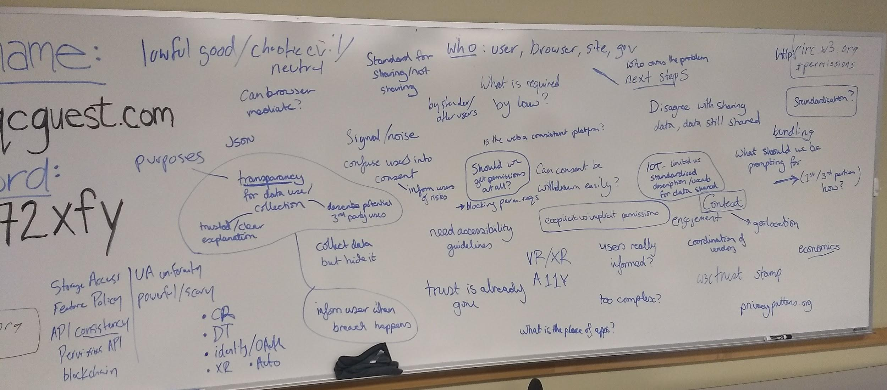

<!----- 

Conversion notes:

* Docs to Markdown version 1.0β17

----->

# Report from W3C Workshop on Permissions and User Consent

## September 26-27, 2018

## San Diego, California

# Executive Summary

There was a widespread recognition that when proposing to add new features, whether to a platform or a web browser, we need to ask “should we do this (at all)”.  It may not be sufficient to ask permission - some features may be simply too dangerous to add. 

We recognized that users suffer from ‘permission fatigue’ (or, perhaps, ‘prompt fatigue’), and the workshop explored several models for avoiding prompts:

*   Implicit consent - as exemplified by the File Access API and drag-and-drop. 
*   Installation ceremonies as an indicator of trust (the “casual web” v. the “installed web”).
*   Using engagement as a metric of trust.  This has significant flaws - people frequently use web sites that they do not trust.

Program committee member Nick Doty produced a summary of our advice for feature developers entitled [“Adding another permission? A guide”](https://github.com/w3cping/adding-permissions/blob/master/README.md). 

Although not specifically on the agenda, web advertising was a heated topic.  It was postulated that, given the rise of ad blockers, advertisers might now be willing to make tradeoffs they were not willing to consider before, namely that in return for having a static advertising ID, they might be willing to agree to 1) not correlate that ID with other info and 2) respect people’s choices to opt-out of using static IDs (e.g. by rotating them for every site).

# Introduction

This workshop prioritized _discussion_ and limited the time for _presentations_.  We allocated a large portion of time to participant-led breakout sessions in the style of Open Space or an unconference.  These breakout sessions were scheduled during the workshop itself.

This report collects some highlights from the individual sessions.  Most are presented as bullet lists.  Some are pearls of wisdom or sound bites that might be useful when considering these topics in the future.  This document ends with 1) a list of specific [follow-up items](#follow-up-items-from-breakouts) that arose in the breakout sessions and 2) some broader [conclusions](#conclusions).  

Inspired by the discussion, program committee member Nick Doty wrote a summary entitled [“Adding another permission? A guide”](https://github.com/w3cping/adding-permissions/blob/master/README.md). 

For those wanting to dig into the specifics, the workshop’s agenda, some slides, and real-time minutes are collected below.  

# Artifacts

## Agenda

Slides, when available, are linked to the corresponding agenda entry:

[https://www.w3.org/Privacy/permissions-ws-2018/schedule.html](https://www.w3.org/Privacy/permissions-ws-2018/schedule.html)

## Participants

[https://www.w3.org/Privacy/permissions-ws-2018/papers.html](https://www.w3.org/Privacy/permissions-ws-2018/papers.html)

## Minutes

Minutes were taken in IRC, as is common W3C practice.  Here are minutes in raw form:

[https://www.w3.org/Privacy/permissions-ws-2018/minutes.html](https://www.w3.org/Privacy/permissions-ws-2018/minutes.html)

# Take-aways from presentations and structured discussions 

## Context; Jo Franchetti

Jo presented a level-setting backgrounder on permissions issues.  [Link to slides](https://docs.google.com/presentation/d/1nWGdoNCWGNVeu00jVt8a4oYm6cMhzvfYlBlPgAubXFs/edit?usp=sharing)

Much of the Internet’s value is based on user trust of the internet; as this trust is broken, the Internet is devalued.  The overload of permission requests is causing fatigue and reducing trust.

*   Anti-pattern: jumping on users as soon as they arrive
*   Anti-pattern: confusing wording / double negatives (e.g. "uncheck here to continue to not receive notifications”)
*   Anti-pattern: blocking all content until consent is coerced - keeps users from gaining trust and understanding the value of the site. 
*   Anti-pattern: ask for unnecessary permissions

## Accountability, Provenance, Timing, and Duration; Martin Thomson

[Slides](https://www.w3.org/Privacy/permissions-ws-2018/Making-Sites-Accountable.pdf)

To whom do sites answer?

See slides for examples of accountability: detecting and punishing misbehavior.

Why would content blocking not be considered the same as malware detection? Malware detection is a backwards strategy. Wait until something bad has happened and then stop additional bad behavior from happening. It’s better to set the foundation to prevent bad behavior from happening. 

It’s important to incorporate privacy into initial specifications. Otherwise it is going to require patching. 

### Persistence

How do browsers deal with persistent permissions?

*   The patterns are not consistent, leading to inconsistent user expectations.
*   Some browsers will remember a “yes” forever.
*   Some cancel the permission when you close the browser,
*   Some cancel the permission when you navigate away from the page. 

Notifications are a good example where the permission grant and consequences are temporally disconnected. Users may not understand consequence of a permission setting until later - e.g. they may be fine with notifications “soon” but find too-common interruptions by notifications problematic later.

Setting expiration policies is tricky.  We allowed cookies to set their own, and we see them setting the maximum time, 15+ years.

Browsers should learn a user’s preferences and set defaults, e.g. when a person constanly says “no” to geolocation, a browser should then default to “no”.

## Permissions in New Contexts (Immersive Web); Nell Waliczek 

[Link to slides](https://www.w3.org/Privacy/permissions-ws-2018/WebXR.pdf)

Risks to the user

*   Fingerprinting during bootstrap (e.g. by device enumeration)
*   Real World Geometry (RWG)
    *   Could identify when two sessions are occuring in the same space
    *   May indicate a specific location
    *   Inferred location history
    *   Estimate size of user’s house, to estimate wealth
    *   Gait analysis
*   Camera Access and perception of camera access
    *   Can users reason about the differences in see-through and pass-through?
    *   Is there any difference if RWG is available?
    *   Polyfills will blur the line
*   Object and image identification
    *   Any object could be registered
    *   Can be used to profile (e.g. identify the presence of a particular brand of TV)
    *   Can be used to blackmail users
*   Emotional impact: XR experiences can be so physically powerful that they create virtual memories and emotional impact. Is the user consenting to this impact?

Mitigations:

*   Check only for VR or AR support, not specific hardware
*   Bootstrap hardware only as last step
*   User permission to enter exclusive mode (see XR breakout below)

     

Questions:

*   Bundle XR permissions
*   Bundle with non-XP permissions
*   Upfront v. just-in-time
*   Duration

How do you adequately express the extent of sharing people are providing when engaging in AR? It’s a wall of text but is there a way to simplify and still express the complete picture?

## Permission Bundling; Harald Alvestrand

[Slides](https://www.w3.org/Privacy/permissions-ws-2018/Permission-bundling.pdf)

A way to combat permission fatigue?

The permission prompt problem:  it’s problematic to have separate questions, e.g. a basic mobile phone app (e.g. Skype) would like to…

*   open popups
*   play sounds
*   use microphone, camera
*   know your location
*   gather network information
*   avoid being suspended when in the background
*   a dozen other permissions you wouldn’t think about

The maximal bundle approach:

“I’m a video phone app. can you allow me to do phone-like things?”

Parties in the consent model:

*   The user (good by definition)
*   the platform (good because all is lost if it isn’t)
*   the application (good, bad, or ugly)

Ways to mediate:

*   Standardize a number of roles, with associated capabilities - let app ask
*   Let the app ask for a bunch of permissions; browser guesses what user wants
*   App asks for permissions, user grades trust in page, browser implies permissions

## New approaches to Permission Management; Serge Egelman and Aleecia McDonald

[Aleecia's slides](https://www.w3.org/Privacy/permissions-ws-2018/w3c-am40.pdf)

## Role of Platforms; Jason Novak, Diane Hosfelt, Tom Lowenthal, and Thomas Nattestad

What should be left to browsers vs app?

*   Tie permission to user event
*   What is value of asset and permission?

In the _immersive web_, permissions take on a new dimension. Because immersion involves a new level of physicality, the permission prompt can impact the user experience, pulling the user out of the event.  The user could be in an uncomfortable virtual situation, i.e. about to go down a roller coaster drop. They may immediately accept a prompt to reduce the anxiety of the situation.

It’s difficult to confirm informed consent. Browser should be agent and steward. Users should be presented with consent requests when they need to make a decision. 

Are we asking users enough questions? If we review a new api and find there are some fingerprinting risks, should we push this to the user? 

Some APIs are data (geolocation) some are functions (notifications) and some are a mix (camera, microphone). It would be good to have a grid that provides user with better understanding of when they are giving access to functionality and data.

# First Day brainstorming

# Take-aways from breakout sessions

## Changes in the Environment

*   Ad blocking has taken off
*   IoT
*   Users trust web site less, even if they don’t understand Cambridge Analytica.  (NSA was buying ads to track Tor users.)

## XR

*   People do not understand the risks in this space, and they’re especially large
*   Even developers of standards do not understand the risks
*   Experimenting with time-limiting of permissions
*   Worried about fingerprinting 
*   Need session setup to succeed even if permissions are not available

Two modes: 

*   Exclusive mode: with permission progressive enhancement.
*   Immersive mode: embed 3d experience in line in a page, just like canvas. when you click a button that says use my harder, that it opens like a full screen that is immersive.

Our permissions mode is based on immersive experience, not the embedded/inline mode.

Consider bundled permissions at the immersive experience.

AR lite mode: allow browser to do automatic image stitching while still allowing hit casting

Applications (e.g. WebRTC) needs to enumerate hardware (e.g. is there a video camera) prior to prompting for permission to use hardware (e.g. join a video chat) that depends on absent hardware.

## Permissions, Policy, and Regulation

*   Anti-pattern: dialog options of “accept” and “learn more” without a “no”.
*   Anti-pattern: requiring login for some service (e.g. Google Hangouts) and then using that to do other things (e.g. sync settings, login to other services)

## Contextual permission models for better privacy protection, Primal Wijesekera 

Custom permission model built for Android, endeavouring to allow access only when the user _expects_ it.  Instead of ask on first use, when users may lack context for the request, present a folllow-up, e.g. “Uber has accessed your location. Given a choice, would you have allowed or denied this access? yes/no”   80% of participants would block at least one permission request.

## Scary Permissions

*   Using engagement as a metric may be dangerous - users may interact frequently with sites they do no trust.
*   Potential for using an “installation ceremony” (e.g. for an app) as a trust indicator.
*   For some of these permissions, we need to be asking if we should do these things at all.  Not sure where to have that conversation.

# Follow-up items from breakouts

The workshop identified these follow-up items from breakout sessions:  

*   More frequently ask “Should we do this?”
*   Study whether displaying explanatory/warning text in browser chrome is confusing (potentially referred to W3C’s Privacy Interest Group)
*   Propose a new API for Consent (referred to the Improving Web Advertising Community Group)
*   Send the Storage Access API to the WICG
*   Consider adding a string to the OAUTH protocol to explain the use of data
*   Find ways to rate browsers (e.g. Consumer Reports-style), ideally using an automated system (e.g. Web Platform Tests)
*   XR group to hold a video conference + meet at TPAC

# Conclusions

There was a widespread recognition that when proposing to add new features (whether to a platform or a web browser) we need to ask “should we do this (at all)”.  It may not be sufficient to ask permission - some features may be simply too dangerous to add. 

We recognized that users suffer from ‘permission fatigue’ (or, perhaps, ‘prompt fatigue’), and the workshop explored several models for avoiding prompts:

*   Implicit consent - as experienced with the File Access API and drag-and-drop.  This is a beloved model.
*   Installation ceremonies as an indicator of trust (the “casual web” v. the “installed web”).
*   Using engagement as a metric of trust.  This has significant flaws - people frequently use web sites that they do not trust.

Although not specifically on the agenda, web advertising was a heated topic.  It was postulated that, given the rise of ad blockers, advertisers might now be willing to make tradeoffs they were not willing to consider before, namely that in return for having a static advertising ID, they might be willing to agree to 1) not correlate that ID with other info and 2) respect people’s choices to opt-out of using static IDs (e.g. by rotating them for every site).

The physical layout of the space influenced the quality of our discussions. Partway through the first day, we rearranged the main room from a classroom layout to a modified “U” shape, and we found the new format more conducive to discussions.  Breakout discussions were better when we were around a boardroom table, all able to face one another.  The total number of attendees, approximately 38, felt slightly too large - or at least at the upper limit - for the format.  We had better discussions in the breakout groups (no matter the room layout), most of which contained 15 or fewer people.

# Acknowledgements and appreciation

First, thank you to all participants who made the trip to San Diego.  This workshop’s use of Open Space with a focus on discussion made the participants key to the success.

Thank you to Giri Mandyam and Qualcomm for hosting the workshop.

Thank you to the [program committee](https://www.w3.org/Privacy/permissions-ws-2018/cfp.html#program-committee), particularly Jo Franchetti, Nick Doty, and Jason Novak.

Thanks to Ted Drake for his extensive contributions to this report.

Thanks to Nell Waliczek for organizing an impromptu social event.

 
<!-- Docs to Markdown version 1.0β17 -->
